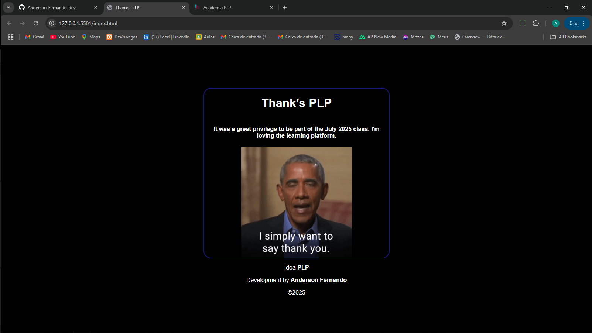

# Week 1 Assignment

## Description

The goal of this assignment is to create a basic web page using **HTML5 semantic tags**, while applying **accessibility best practices** and basic **SEO principles**.

## Implementation Details

To complete the task, I used semantic structural tags such as `<header>` to define the page header and `<footer>` to define the page footer. These elements help improve both accessibility and search engine optimization (SEO).

### Header

Inside the `<header>` tag, the following elements were included:

- `<h1>` – Used for the main title of the page  
- `<h6>` – Used for a secondary subtitle  
- `` – Displays a fun animated GIF

### Footer

Inside the `<footer>` tag, I included:

- Three `
` tags to display copyright

## Preview

<a href="https://thanks-plp.netlify.app/" target="_blank">Access the project</a>
